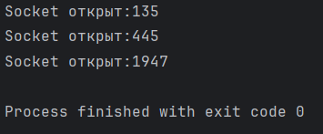

# Сканер TCP/UDP портов

Параметры по умолчанию: хост - "localhost", диапазон портов: 1 - 65535. Для запуска кода можно использовать параметры:
--name - введите Ip-адрес или доменное имя;
--under и --top - диапазон сканирования портов

## Описание
Программа для сканирования открытых TCP и UDP портов на указанном хосте

## Тестирование программы 
при входных данных параметрах(--under 25 --top 2500)

